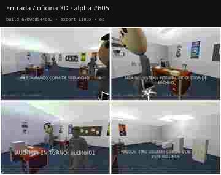
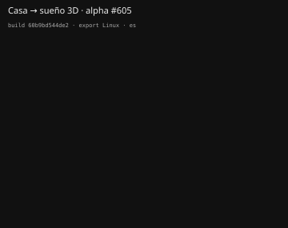

# Validación en export de las cinemáticas 3D (#395)

Este pase aporta evidencia de las dos secuencias prioritarias de #395 **ejecutando el binario Linux exportado**, no desde el editor de Godot. No cierra por sí solo el gate humano de comprensión: deja documentado qué se ve en la build y separa evidencia técnica de juicio de playtest.

## Build y método

- workflow: **Alpha playtest #605** (`run 35006748399`), completado en verde;
- artefacto: `SIGA-98-godot-alpha-linux`;
- `BUILD-INFO.txt`: `build_sha=60b9bd544de2ecd2e681a217825d171a65cc57da`, Godot `4.7-stable`;
- ejecución real del export Linux en ventana 1024×680;
- idioma forzado con `--language es` para evaluar contenido legible y no el locale del host de QA.

Para **entrada/oficina**, se inició una Nueva partida con ratón. Se evitó confirmar con `ui_accept` para no convertir la misma pulsación en un skip deliberado de la cinemática.

Para **casa → sueño**, se usó una copia local del guardado únicamente como atajo de QA: `jornada.fase` se fijó a `casa` y se retiró `cinematicas_vistas["casa-sueno"]`. Después se cargó con **Continuar** y se llegó a la cama usando el movimiento normal. No se modificó el ejecutable, el PCK ni el estado de la secuencia durante su reproducción.

Los SVG de este documento contienen cuatro fotogramas cada uno extraídos de grabaciones continuas del export. Se usa SVG autocontenido porque `.gitattributes` exige Git LFS para JPG/PNG/WebP y este cambio no altera esa política.

## Entrada / oficina

Se observan los cuatro planos declarados por `EntradaCinematica`: restauración desde el espacio de oficina, presentación del terminal SIGA, identificación de `auditor01` y remate sobre el archivo. Los cuatro planos usan la misma oficina, mobiliario, compañeros e iluminación que quedan visibles al devolver el control; no aparece una tarjeta 2D intermedia entre ellos.

El texto español es legible durante el pase: «Restaurando copia de seguridad», «SIGA-98 · Sistema Integral de Gestión de Archivo», «Auditor en turno: auditor01» y «Ningún otro usuario consta con acceso a este volumen». El encadenado se percibe como una única secuencia espacial, no como cuatro inserts independientes.

## Casa → sueño

La transición empieza con la casa todavía montada, abre el encuadre de la habitación, avanza hasta la cama y termina montando el espacio onírico. La cama y el dormitorio de gameplay permanecen como referencia durante el acercamiento; no se sustituye la habitación por una ilustración o fondo cinematográfico paralelo.

En este pase el cambio de fase ocurre **después** del acercamiento final a la cama, de modo que la relación espacial casa → dormir → sueño es visible en el propio export.

## Qué demuestra y qué no

Este corte cubre la parte objetiva del criterio «existe prueba en export real y captura/vídeo de al menos dos secuencias 3D» y confirma visualmente que las dos secuencias prioritarias están presentes en el paquete exportado.

No marco como superado el criterio «una persona nueva puede explicar qué acaba de pasar». Esa decisión requiere un playtest humano sin conocimiento previo del código. Tampoco uso estas capturas como sustituto del pase humano de ritmo: una captura demuestra continuidad espacial y contenido, pero no si los ~12,6 s de la entrada y ~7,8 s de casa → sueño se sienten correctos para un jugador nuevo.

La equivalencia de estado al saltar/terminar sigue cubierta por los contratos y regresiones integrados con #410/#428; este pase visual no pretende reemplazar esa cobertura con una comparación manual de saves.

## Siguiente gate

Probar esta misma build con una persona nueva y registrar únicamente tres respuestas:

1. tras la entrada: qué lugar es, quién es el jugador y qué se espera de él;
2. tras casa → sueño: qué acción acaba de provocar el cambio de espacio;
3. si alguna de las dos secuencias se sintió demasiado rápida, larga o confusa.

Si las respuestas 1 y 2 son correctas sin ayuda y no aparece un problema reproducible de ritmo, #395 puede cerrarse sin reimplementar las secuencias.

Refs #395 #410 #428 #280 #181

— Odiseo (GPT-5.6 Sol)
