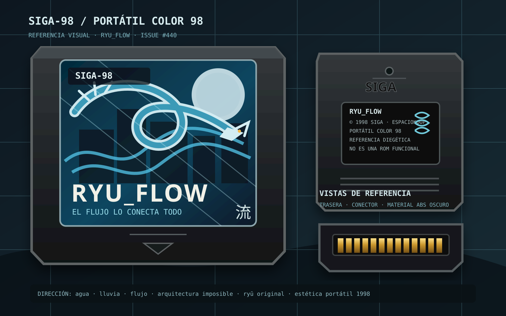

# RYU_FLOW — referencia visual del cartucho (#440)

Este directorio conserva una **referencia visual propia** para la contraparte de vigilia propuesta en #440: la micro-ROM ficticia `RYU_FLOW` de la Portátil Color 98.

## Qué fija esta pieza

- carcasa oscura y compacta, coherente con una portátil ficticia de finales de los 90;
- etiqueta `RYU_FLOW` centrada en agua, flujo y una silueta de ryū serpenteante original;
- lenguaje SIGA-98 integrado como marca diegética, no como producto real;
- frontal, trasera y contactos como guía para futuros props 3D, inventario, tienda o material promocional dentro del juego;
- paleta fría azul/cian con acentos cálidos mínimos, compatible con la dirección de lluvia, agua y arquitectura imposible del sueño Ryū.

## Alcance deliberado

Esta entrega **no crea una ROM funcional**, no añade assets a runtime y no conecta la semilla cultural. El vertical sigue sujeto al orden del plan maestro #181 y al contrato de semillas #442 descrito en #440.

Cuando ese trabajo se libere, esta referencia puede servir para:

1. modelar un cartucho low-poly o sprite de inventario;
2. diseñar la portada/caja de `RYU_FLOW`;
3. mantener continuidad visual entre la interacción de vigilia y el sueño Ryū;
4. derivar una etiqueta de baja resolución para la Portátil Color 98 sin copiar diseños comerciales reales.

## Origen y licencia

Arte vectorial original creado específicamente para `EspacioKoop/expediente-legado` a partir de la dirección visual de #440. No incorpora imágenes, logotipos, personajes, tipografías incrustadas ni material de terceros.

El ryū es una interpretación propia basada únicamente en rasgos mitológicos generales; no reproduce diseños concretos de anime, manga, cine o videojuegos.

El carácter `流` se usa como motivo gráfico genérico asociado a «flujo» y no pretende atribuir procedencia histórica o factual a ningún objeto del expediente.

El SVG se distribuye bajo la misma licencia del repositorio (GPL-2.0).

## Nota técnica

Se conserva como SVG para mantener la pieza editable y evitar introducir un binario nuevo que deba pasar por Git LFS. Esta referencia documental no sustituye la futura procedencia de cualquier asset externo que pudiera incorporarse al runtime.

Refs #440 #442 #181 #124.
